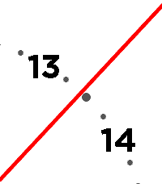
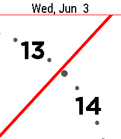
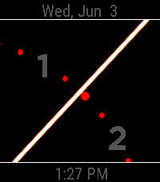

# Pebble Macro Clock

  
  
  

A version of [shamHu's Macro Clock][1] that works on the new core devices app
and the newer watches' larger screens.

This clock features a zoomed in clock face where you only see the hour-hand.
Configurable:
- Colours
- Date banner (off, on flick, always)
- Digital time banner (off, on flick, always)
- 12h or 24h format
